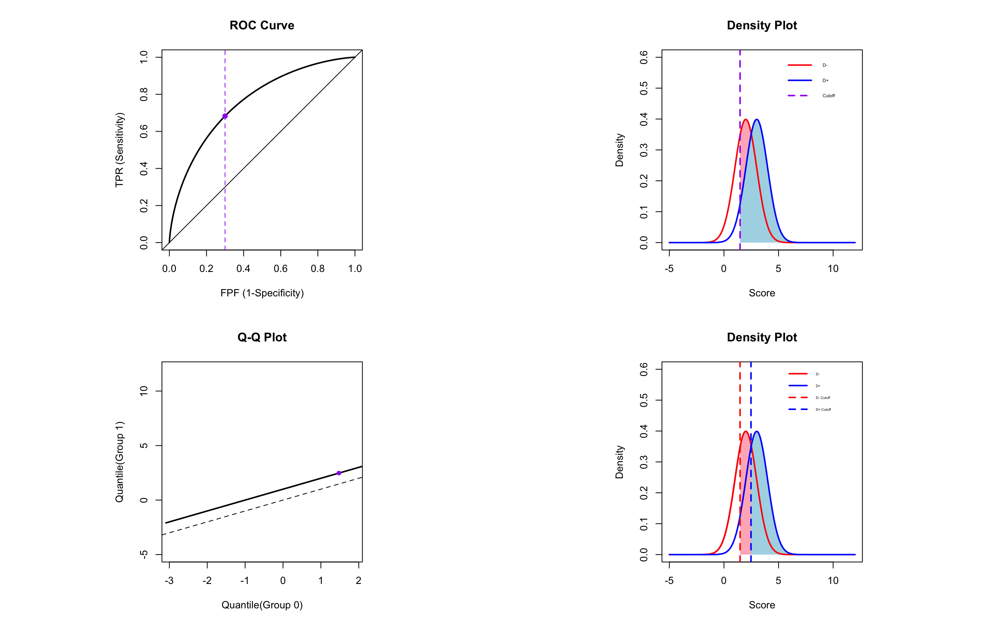

## Description
A custom R function for plotting ROC curves and related visualizations.

## Usage
- plot.roc()

## Features
- Plots ROC curves
- Displays density plots
- Generates Q-Q plots

## Parameters 
- m.0: Mean of Group 0
- m.1: Mean of Group 1
- sd.0: Standard deviation of Group 0
- sd.1: Standard deviation of Group 1
- prob: Probability threshold

